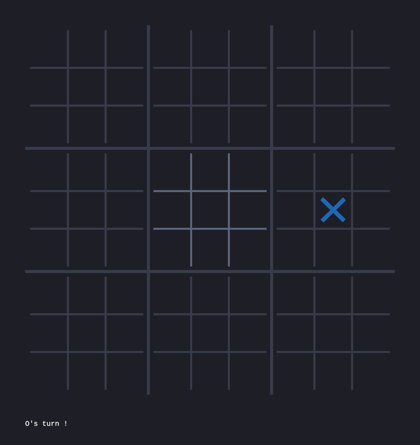

# Ultimate-morpion
This is an implementation of the game called Ultimate Tic-Tac-Toe which is basically nine tic-tac-toe in one big tic-tac-toe.
This game can be played in several ways. Here is the most common version of the rules. Check the [Wikipedia's page](https://en.wikipedia.org/wiki/Ultimate_tic-tac-toe) for more informations.

## Rules
X begins and plays in an empty spot. After each turn, the other player plays in the little tic-tac-toe board corresponding to where the former player played.
Game ends when:
- There is nowhere left to play, or
- One player won the big tic-tac-toe board

## Screenshots
<p align="center">
  
  
  
</p>

## Installation
First install Rust:
```bash
curl --proto '=https' --tlsv1.2 -sSf https://sh.rustup.rs | sh
```
Check the [Official Rust Installation Guide](https://www.rust-lang.org/tools/install) for more informations.

Then, clone this repository and build the project with Cargo:
```bash
git clone https://github.com/lilBchii/ultimate-morpion
cd ultimate-morpion
cargo build --release
```
This may take a long time.
The resulting executable will be found in `target/release/`.

## Dependencies 
This game uses [ggez](https://github.com/ggez/ggez).
